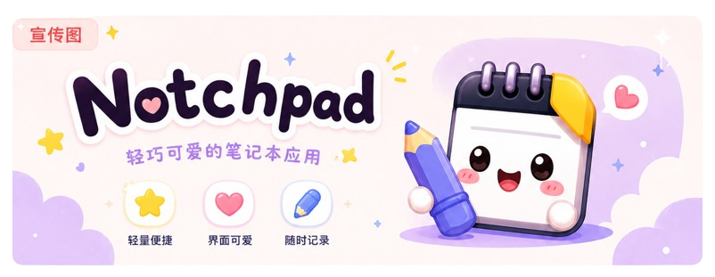

<div align="center">

# Notchpad

**一款刚海风格的桌面便签应用**

Electron + Vue 3 + TipTap — 紧贴屏幕顶部 — 弹性动画 — 深色/浅色主题

</div>

---

## 特性

### 灵动刚海交互
应用启动后自动收起为屏幕顶部中央的小药丸，悬浮或点击即可展开完整编辑区域。支持悬停唤醒和点击唤醒两种模式。

### 富文本编辑器
基于 TipTap 构建，支持加粗、斜体、删除线、代码、引用、列表、任务列表、链接、截图粘贴（自动压缩至1920px）、字体样式、字数统计。

### 多页面管理
最多10个页面，胶囊导航栏切换，支持拖拽排序。

### 页面标题编辑
双击圆点编辑标题，悬浮显示Tooltip。

### 多显示器支持
Ctrl+Shift+M循环切换显示器，选择自动持久化。

### 数据持久化
SQLite本地存储，支持自定义存储位置和数据导入导出。

### 键盘快捷键
Ctrl+N新建、Ctrl+D删除、Ctrl+S保存、Ctrl+Z撤销、Ctrl+Y重做、Ctrl+W最小化、Ctrl+Alt+Z呼出窗口、Ctrl+Tab/Shift+Tab翻页、Ctrl+1~9跳转、Ctrl+Shift+M切换显示器。

### 自动保存与图片压缩
编辑后自动保存，底部显示状态。粘贴图片自动压缩至1920px宽度。

---

## 技术栈

Electron 39 + Vue 3.5 + electron-vite + TipTap 3 + motion-v + sql.js + TypeScript + pnpm

---

## 快速开始

```bash
git clone https://github.com/TIUCSIB/notchpad.git
cd notchpad
pnpm install
pnpm dev
```

构建：pnpm build:win / pnpm build:mac / pnpm build:linux

---

## License

MIT